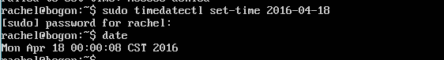
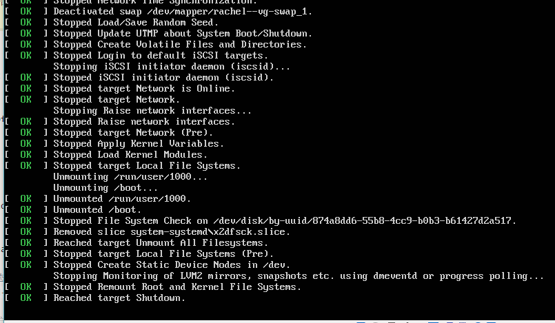

# SYSTEMD实战

## 视频地址

* 命令篇
  * 查看启动耗时、查看主机信息、查看并修改本地化设置
    * https://asciinema.org/a/1FQMJDIrAFevLXL1XMpcu2d5H
  * 查看当前的登录用户、Unit系列操作
    * https://asciinema.org/a/1XMc2o4D3BBfiKHn2cO8yJ0oG
  * Unit管理及其之间的依赖关系
    * https://asciinema.org/a/EBCy1MUzefUsgBfDxx6hKanB0
  * Unit配置文件以及Target
    * https://asciinema.org/a/tO8S4rFWKgV49YMecbHPW1szH
  * 日志管理
    * https://asciinema.org/a/XF8qwFZ9BlVX25QEp98kGQxvL


* 实战篇
  * 开机启动、启动服务、停止服务、配置文件查看及阅读、[service]区块的启动行为
    * https://asciinema.org/a/nipKK5XA6QIEkAirvh2wmyzbL
  * [Install]区块、Target配置文件、修改配置文件后重启
    * https://asciinema.org/a/2Rh2bZiY9pCrBKBh46X3Ye1JX

注：部分命令未录像，如使用systemctl重启、休眠系统等。

* `timedatactl` 设置系统时间时需要先关闭利用网络自动同步
  * `sudo timedatactl set-ntp false`
  * 


* 使用 `systemctl`进行系统管理
  * 这里截取部分实验示意图，其他类似
  * CPU停止工作
    * 
  * 暂停系统、系统进入冬眠状态、让系统进入交互式休眠状态
    * 
    * 
    * ​
    * 系统黑屏

## 自查清单

* 如何添加一个用户并使其具备sudo执行程序的权限？

  * ```shell
    # 创建新用户
    useradd -m newuser 
    # 设置密码
    passwd newuser
    # 添加用户到 sudo 组
    usermod -a -G sudo newuser 
    ```

* 如何将一个用户添加到一个用户组？

  ````shell
  # 将 newuser 添加到组 staff 中
  usermod -G staff newuser
  ````

* 如何查看当前系统的分区表和文件系统详细信息？

  * `fdisk -l`

* 如何实现开机自动挂载Virtualbox的共享目录分区？

  * 安装增强功能
  * 配置共享文件夹`https://blog.csdn.net/skylake_/article/details/53132499`
  * /etc/fstab 文件中，添加 `sharing /mnt/share vboxsf defaults 0 0`

* 基于LVM（逻辑分卷管理）的分区如何实现动态扩容和缩减容量？

  * `https://blog.csdn.net/seteor/article/details/6708025`
  * 将逻辑卷组挂载到物理卷组下
  * 在物理卷组有足够剩余空间时,可以对逻辑分区进行扩容
  * 扩容分区
    * `lvextend -L +10G -f -r /dev/vg_server1/local`
  * 减少分区容量
    * `lvreduce -L -10G -f -r /dev/vg_server1/local`

* 如何通过systemd设置实现在网络连通时运行一个指定脚本，在网络断开时运行另一个脚本？

  * 在networking.service配置文件的区块[Service]处填写`ExecStart`和`ExecStop` 的脚本路径

  ```
  ExecStart=<脚本路径>
  ExecStop=<脚本路径>
  ```

* 如何通过systemd设置实现一个脚本在任何情况下被杀死之后会立即重新启动？实现**杀不死**？

  * 将`Service`区块的`Restart`字段设置参数为`always` ,即不管是什么原因退出，总是重启。