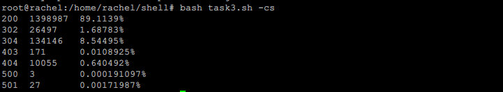

# bash编程

## 任务一

* 命令行参数方式使用不同功能
  * 帮助文档
    * 
* 对以下常见图片批处理功能的单独使用
  * 对jpeg格式图片进行图片质量压缩
    * 
    * 
  * 对jpeg/png/svg格式图片在保持原始宽高比的前提下压缩分辨率
    * 

* `watermark contant`对图片批量添加自定义文本水印
  * 
  * 
* `changename` 批量重命名
  * 添加前缀
    * 
    * 
  * 添加后缀
    * 

## 任务二

* **用bash编写一个文本批处理脚本，对以下附件分别进行批量处理完成相应的数据统计任务**
  * [2014世界杯运动员数](http://sec.cuc.edu.cn/huangwei/course/LinuxSysAdmin/exp/chap0x04/worldcupplayerinfo.tsv)

* 统计不同年龄区间范围（20岁以下、[20-30]、30岁以上）的球员**数量**、**百分比**
  * 
* 统计不同场上位置的球员**数量**、**百分比**
  * 
* 名字最长的球员是谁？名字最短的球员是谁？
  * 
* 年龄最大的球员是谁？年龄最小的球员是谁？
  * 

## 任务三

* **用bash编写一个文本批处理脚本，对以下附件分别进行批量处理完成相应的数据统计任务**
  * [Web访问日志](http://sec.cuc.edu.cn/huangwei/course/LinuxSysAdmin/exp/chap0x04/web_log.tsv.7z)
* 统计访问来源主机TOP 100和分别对应出现的总次数
  * 

- 统计访问来源主机TOP 100 IP和分别对应出现的总次数
  * 
- 统计最频繁被访问的URL TOP 100
  - 
- 统计不同响应状态码的出现次数和对应百分比
  - 
- 分别统计不同4XX状态码对应的TOP 10 URL和对应出现的总次数
  - 
- 给定URL输出TOP 100访问来源主机
  - 